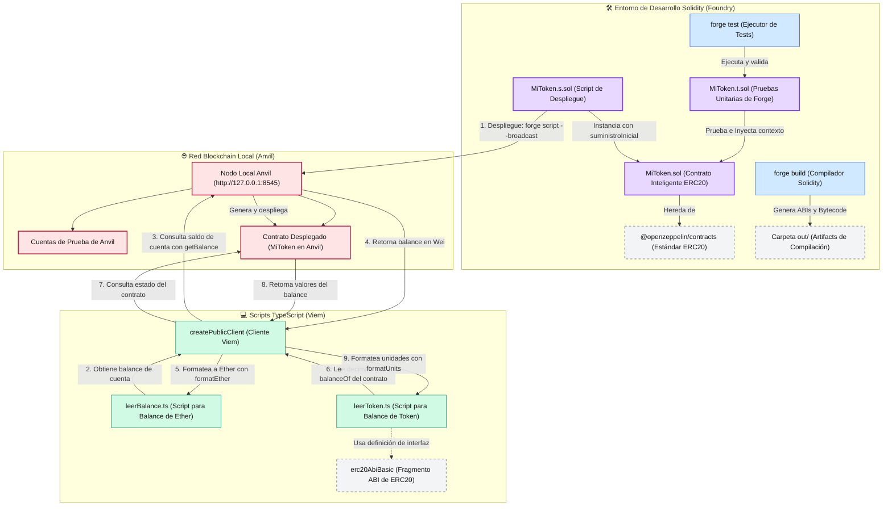

# Practice ERC20: Desarrollo de Smart Contracts e Interacción con Viem

Este es un proyecto de práctica diseñado para aprender y experimentar con el desarrollo de Smart Contracts (estándar ERC20) utilizando **Solidity** y **Foundry**, así como la interacción y lectura de datos desde la Blockchain a través de **TypeScript** y **Viem**.

## 🗺️ Arquitectura del Proyecto y Flujo de Trabajo

El siguiente diagrama detalla la arquitectura del proyecto, la interacción entre componentes y el flujo de ejecución completo:



---

## 🛠️ Tecnologías y Herramientas

*   **Smart Contracts:** Solidity (^0.8.20) y OpenZeppelin Contracts.
*   **Entorno de Solidity (Foundry):**
    *   **Forge:** Compilación, formateo y pruebas unitarias de los contratos.
    *   **Anvil:** Nodo local de Ethereum (red local de desarrollo en el puerto `8545`).
*   **Cliente / Scripting (TypeScript):**
    *   **Viem:** Cliente ligero y moderno para interactuar con nodos de Ethereum (Anvil/Mainnet).
    *   **TS-Node:** Ejecución directa de scripts TypeScript en Node.js configurado con módulos ES (ESM).

---

## 📁 Estructura del Proyecto

*   [`src/`](file:///wsl.localhost/Ubuntu/home/matias/practice-erc20/src): Contiene los contratos inteligentes en Solidity (ej. `MiToken.sol`).
*   [`test/`](file:///wsl.localhost/Ubuntu/home/matias/practice-erc20/test): Pruebas unitarias de Solidity escritas para Forge (ej. `MiToken.t.sol`).
*   [`script/`](file:///wsl.localhost/Ubuntu/home/matias/practice-erc20/script): Scripts de Foundry en Solidity para el despliegue de contratos (ej. `MiToken.s.sol`).
*   [`scripts-ts/`](file:///wsl.localhost/Ubuntu/home/matias/practice-erc20/scripts-ts): Scripts en TypeScript para interactuar con la Blockchain local mediante Viem (ej. `leerBalance.ts` y `leerToken.ts`).

---

## 🚀 Guía de Uso y Comandos

### 1. Instalación de Dependencias

Instala los módulos de Node.js necesarios para los scripts de TypeScript:
```shell
npm install
```

*(Opcional) Si necesitas descargar las librerías de Solidity submoduladas en Git:*
```shell
git submodule update --init --recursive
```

### 2. Flujo de Trabajo en Solidity (Foundry)

*   **Compilar los contratos:**
    ```shell
    forge build
    ```

*   **Ejecutar los tests unitarios:**
    ```shell
    forge test
    ```

*   **Formatear el código Solidity (obligatorio para pasar CI):**
    ```shell
    forge fmt
    ```

### 3. Simulación y Despliegue Local (Anvil)

1.  **Inicia tu red local de prueba (nodo Anvil):**
    ```shell
    anvil
    ```
    *(Este comando se quedará corriendo en la terminal y te dará una lista de cuentas públicas y sus claves privadas).*

2.  **Desplegar el Smart Contract en Anvil:**
    Abre una nueva terminal y ejecuta el script de despliegue usando una de las llaves privadas generadas por Anvil:
    ```shell
    forge script script/MiToken.s.sol:MiTokenScript --rpc-url http://127.0.0.1:8545 --broadcast --private-key 0xf39fd6e51aad88f6f4ce6ab8827279cfffb92266
    ```

### 4. Ejecutar los Scripts de TypeScript (Viem)

Con el nodo Anvil corriendo y el contrato desplegado:

*   **Leer el balance de Ether nativo de una dirección en Anvil:**
    ```shell
    npx ts-node scripts-ts/leerBalance.ts
    ```

*   **Leer datos (decimales, balances) de tu token ERC20 personalizado:**
    Asegúrate de actualizar la dirección de tu contrato en el archivo `scripts-ts/leerToken.ts` y luego ejecuta:
    ```shell
    npx ts-node scripts-ts/leerToken.ts
    ```

---

## 📝 Notas de Aprendizaje

Este repositorio sirve para practicar conceptos clave de la Web3:
*   Creación y acuñación de tokens ERC20 heredando de OpenZeppelin.
*   Uso de `vm.prank` y utilidades de simulación en tests de Foundry.
*   Conexión de clientes de lectura pública (`createPublicClient`) usando Viem.
*   Conversión de unidades de Blockchain (Wei / BigInt a decimales legibles mediante `formatEther` y `formatUnits`).

